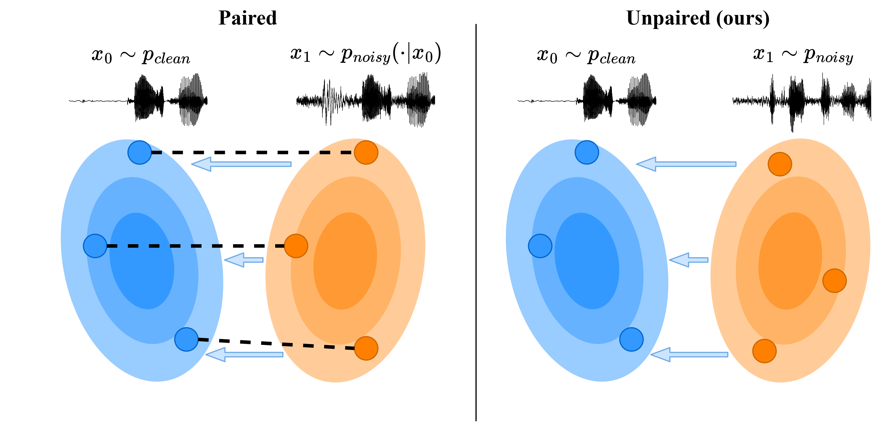

# SE-MSB: End-to-End Unpaired Speech Enhancement using Mamba Schrödinger Bridges

## Abstract

Speech enhancement (SE) models typically rely on supervised learning with paired data examples where clean speech is synthetically degraded. This paradigm limits performance in real-world scenarios where the target environment's specific acoustic characteristics are unknown. We propose a fully unpaired SE framework that uses principled Diffusion Schrödinger Bridges (DSB) to learn a stochastic transport process between a clean and a degraded speech distribution.

Algorithms for learning transport maps are computationally heavy since they require simulating differential equations during training, usually at each training step. Therefore, we propose using a high-efficiency Mamba Diffusion Model designed for end-to-end waveform processing. We compare against state-of-the-art methods for speech enhancement, both paired and unpaired, as well as a classical signal processing algorithm.

Experimental results show that we are on par or better than the baselines while being orders of magnitude faster during inference. Furthermore, we show that the flexibility of the DSB formulation allows our model to generalize across SE tasks, offering a robust and efficient solution for real-world speech restoration.

### Algorithm Overview



### Interactive Demo

Visit our **[demo website](https://kommodeskab.github.io/Latent-DSB/)** to listen to audio samples.

---

## Quick Start

### Initialize the project

```bash
uvx invoke build
```

### Fill out `.env`

Add relevant API keys and paths (local data path, Weights & Biases, Hugging Face, etc.).

### (Optional) Install pre-commit

```bash
pip install pre-commit
```

## Running Experiments

- Run an experiment:

```bash
python main.py experiment=<experiment-name>
```

- Override arguments on the command line:

```bash
python main.py experiment=<experiment-name> data.batch_size=2
```

- Run with compiled model:

```bash
python main.py experiment=<experiment-name> compile=True
```

- Continue a previous training run using W&B run ID + checkpoint file:

```bash
python main.py experiment=<experiment-name> continue_from_id=<id> ckpt_filepath=<filepath>
```

- Start a new run but initialize from another checkpoint:

```bash
python main.py experiment=<experiment-name> ckpt_filepath=<filepath>
```

## Invoke Tasks

Run tasks with:

```bash
invoke <task-name>
```

Available tasks are defined in `tasks.py`. For example:

```bash
invoke format
```
